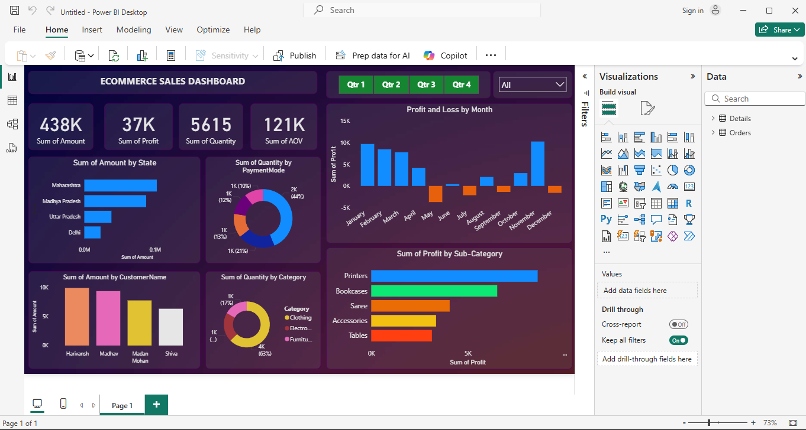

# 🛒 E-commerce Sales Dashboard – Power BI

This project showcases a simple and interactive e-commerce sales dashboard built using **Microsoft Power BI**.

## 📌 Features

- Total Sales and Revenue Overview  
- Top-Selling Products and Categories  
- Sales by Region  
- Monthly and Daily Sales Trends  
- Customer Purchase Behavior Analysis

## 📁 File

- `ecommerce_sales_dashboard.pbit` – Power BI dashboard file

## 📸 Dashboard Preview

## 📊 Tools Used

- Power BI  
- Excel (as data source)  
- Data Cleaning and Visualization techniques

## 📂 How to Use

1. Download the `.pbix` file
2. Open it in Power BI Desktop
3. Explore and interact with the dashboard visuals

## 💡 Purpose

This dashboard is designed to help businesses gain insights into their sales performance and make data-driven decisions.

---

